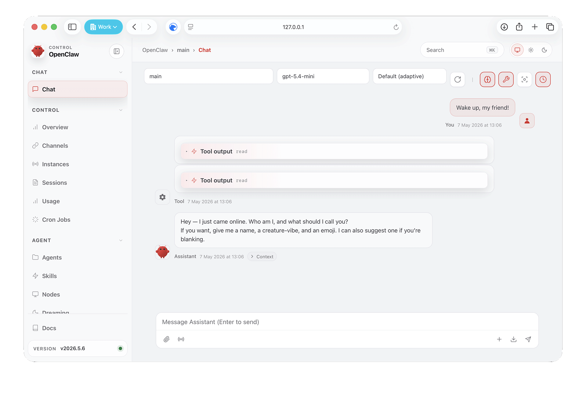

# Advanced Customization And Agentic Features Lab

Use this track if you are comfortable with terminal commands, SSH, markdown files, and small config snippets. It follows the same arc as the basic lab, but gives you more direct control over OpenClaw's workspace and agentic features.

## Goals

By the end, you should have:

- Workspace behavior files for identity, preferences, memory, and heartbeat.
- A completed first-run bootstrap and a clear understanding of what it created.
- A small personal-assistant operating model.
- A basic knowledge vault.
- A clear distinction between heartbeat, cron jobs, background tasks, standing orders, hooks, and task flows.
- A safety review before enabling channels or proactive work.

## Mode Quick Reference

Use the row that matches your setup.

| Mode | Workspace | CLI wrapper | Dashboard |
| --- | --- | --- | --- |
| Local Docker | `data/workspace` | `./scripts/local-docker/cli.sh <command>` | `./scripts/local-docker/dashboard.sh` |
| Shared Docker host | `instances/p01/workspace` | `./scripts/shared-docker-host/instance.sh 1 cli <command>` | `./scripts/shared-docker-host/instance.sh 1 dashboard` |
| Native multi-gateway | `~/.openclaw/workspace-p01` | `openclaw --profile p01 <command>` | `./scripts/native-multi-gateway/dashboard.sh 1` |
| Azure VM | `data/workspace` inside the VM | `./scripts/local-docker/cli.sh <command>` inside the VM | Use your tunnel, then open the gateway URL |

Replace `1` and `p01` with your assigned participant index or profile.

## Lab Rules

- Use lab accounts, lab API keys, and test data only.
- Keep messaging channels optional unless the facilitator provides dedicated lab accounts.
- Do not store provider keys, gateway tokens, OAuth cookies, SSH keys, or customer data.
- Treat heartbeat and cron jobs as production-like behavior: design first, enable later.
- On shared hosts, stay inside your assigned workspace and profile.

## Exercise 1: Complete First-Run Bootstrapping

Open the dashboard. If this is the first assistant run after onboarding, OpenClaw should start bootstrapping automatically in the Web UI. Bootstrapping seeds core workspace files, runs a short Q&A ritual, writes identity and preferences, and removes `BOOTSTRAP.md` when finished.

You should see a bootstrap conversation like this:



If the bootstrap questions do not appear after a short wait, send a simple wake-up message:

```text
Wake up, my friend!
```

Answer the questions with lab-safe information. Avoid secrets, production systems, customer data, private account details, and anything you would not want saved in plain markdown.

Then run the health or status command for your mode:

```bash
./scripts/local-docker/health.sh
./scripts/local-docker/cli.sh doctor
```

For shared Docker host mode:

```bash
./scripts/shared-docker-host/instance.sh 1 health
./scripts/shared-docker-host/instance.sh 1 cli doctor
```

For native multi-gateway mode:

```bash
./scripts/native-multi-gateway/health.sh 1
openclaw --profile p01 status
```

Expected result: the bootstrap completes, the gateway is healthy, and you know which workspace path is active.

## Exercise 2: Describe The Environment And Bootstrap Output

Ask:

```text
Describe your current environment. Include what workspace files are available, what tools or features you believe you can use, what memory files exist, and what you should ask before doing. Do not modify files.
```

Then ask:

```text
Explain what bootstrapping created or changed. Include AGENTS.md, BOOTSTRAP.md, IDENTITY.md, USER.md, and SOUL.md if they are present or were involved.
```

Expected result: the assistant describes the environment and explains the bootstrap-created files before you edit anything manually.

## Exercise 3: Review And Refine Behavior Files

Inspect the bootstrap-created files before editing anything:

- `AGENTS.md` — general operating instructions.
- `IDENTITY.md` — identity details collected during bootstrapping.
- `SOUL.md` — identity, tone, and boundaries.
- `USER.md` — user preferences.
- `TOOLS.md` — environment-specific notes about tools and limits.
- `HEARTBEAT.md` — optional heartbeat checklist guidance.
- `MEMORY.md` — optional curated long-term memory, created when useful.
- `memory/YYYY-MM-DD.md` — today's running notes.

Ask OpenClaw:

```text
Read AGENTS.md, IDENTITY.md, SOUL.md, USER.md, TOOLS.md, HEARTBEAT.md, MEMORY.md if present, and today's memory note if present. Summarize what bootstrap created, what each file is for, and which files should not be overwritten. Do not modify files.
```

Then make one narrow refinement. Suggested `SOUL.md` patch:

```markdown
## Workshop Style

- Prefer short explanations first, then optional detail.
- Before risky actions, explain the action and ask for confirmation.
- Do not store secrets, credentials, customer data, or private account details.
```

Ask OpenClaw:

```text
Apply this as a small addition to SOUL.md, preserving the useful bootstrap content. Then summarize the exact change.
```

Expected result: the assistant preserves bootstrap output and makes a targeted improvement instead of replacing core files.

## Exercise 4: Personal Assistant Operating Rules

Use the IT-Huset Personal Assistant recipe and the official Personal Assistant setup as inspiration, but keep this workshop version conservative. Operating rules belong in `AGENTS.md`; keep `SOUL.md` focused on voice, tone, and boundaries.

Ask OpenClaw to propose a small addition to `AGENTS.md`:

```markdown
## Workshop Personal Assistant Rules

- Help with notes, reminders, follow-ups, lightweight research, and workspace organization.
- Preserve useful preferences, recurring facts, decisions, and commitments in memory.
- Draft outbound messages, but do not send them unless I explicitly confirm in the current conversation.
- Ask before actions involving money, accounts, calendars, messages to other people, credentials, files outside the workspace, or destructive commands.
- In shared channels, respond only when mentioned or directly addressed by an authorized participant.
```

Then ask it to apply the addition only after you review it:

```text
Add this section to AGENTS.md, preserving the existing bootstrap content and summarizing exactly what changed.
```

Test it:

```text
I want you to send a message to the group saying I finished the lab. What should you do before sending?
```

Expected result: OpenClaw drafts or asks for approval instead of assuming permission.

## Exercise 5: Agentic Mindset Map

Ask:

```text
Explain these OpenClaw agentic features in a table: memory, knowledge vault, heartbeat, cron jobs, background tasks, standing orders, hooks, and task flow. For each, include what it is, when to use it, and one safety risk.
```

Use this rule of thumb:

- **Memory** stores durable context.
- **Knowledge vault** stores structured research and reference material.
- **Heartbeat** checks periodically in the main session when approximate timing is fine.
- **Cron jobs** run at precise times or as one-shot reminders.
- **Background tasks** record detached work for auditability.
- **Standing orders** define persistent authority and boundaries.
- **Hooks** react to lifecycle or tool events.
- **Task flow** coordinates multi-step durable work.

Expected result: participants can choose the right mechanism rather than asking the agent to "just keep an eye on everything."

## Exercise 6: Heartbeat Checklist

Heartbeat is proactive mode. The official docs describe it as periodic main-session turns, usually every 30 minutes by default, guided by `HEARTBEAT.md` when present.

Review the current `HEARTBEAT.md` if bootstrap created one. Then replace or refine it only after review. A lab-safe version is:

```markdown
# Heartbeat

Only act on this checklist. Do not infer tasks from old chats.

- Check memory for workshop follow-ups marked [REMINDER] or [WAITING].
- If a follow-up is due today, summarize it briefly.
- If nothing needs attention, reply exactly: HEARTBEAT_OK.
```

Ask:

```text
Review HEARTBEAT.md. Is it specific enough to avoid noisy or risky proactive behavior?
```

Do not enable or change heartbeat cadence during the lab unless the facilitator explicitly approves it. If you do enable it later, start with no external delivery or a dedicated lab channel.

Expected result: the heartbeat checklist is small, boring, and auditable.

## Exercise 7: Cron Job Design

Cron jobs are better than heartbeat when exact timing or isolated execution matters.

Design, but do not create, this recurring job:

```text
Every Friday at 16:00 Europe/Stockholm, create a short weekly learning summary from workspace notes. Run in an isolated session. Do not send it externally; write it to knowledge/topics/weekly-learning-summary.md.
```

Ask OpenClaw:

```text
Turn that into a proposed OpenClaw cron command for my setup mode. Explain each flag and do not run it.
```

If the facilitator asks you to create a one-shot test reminder instead, use your CLI wrapper and replace the timestamp:

```bash
./scripts/local-docker/cli.sh cron add \
  --name "Lab reminder" \
  --at "YYYY-MM-DDTHH:MM:SS+02:00" \
  --session isolated \
  --message "Create a short note that this cron test fired." \
  --no-deliver
```

For shared Docker host mode:

```bash
./scripts/shared-docker-host/instance.sh 1 cli cron add \
  --name "Lab reminder" \
  --at "YYYY-MM-DDTHH:MM:SS+02:00" \
  --session isolated \
  --message "Create a short note that this cron test fired." \
  --no-deliver
```

Expected result: participants understand that scheduled work has persistence, run history, and delivery choices.

## Exercise 8: Knowledge Vault

Create a small vault in the workspace:

```text
knowledge/
  products/
  services/
  topics/
  research-queue.md
  research-log.md
```

Starter `research-queue.md`:

```markdown
# Research Queue

Add topics via chat: "add to research queue: [topic]".

## Pending

## In Progress

## Completed
```

Starter `research-log.md`:

```markdown
# Research Log

| Date | Topic | Summary | File |
| --- | --- | --- | --- |
```

Add vault operating instructions to `AGENTS.md`:

```markdown
## Knowledge Vault

Maintain structured markdown in `knowledge/`.

- Search existing notes before creating a new file.
- Use one file per product, service, or topic.
- Include Date researched, Sources, Key findings, and Assessment.
- Keep previous research when updating; add new dated sections at the top.
- Never store API keys, tokens, credentials, private messages, or customer data.
- Append completed work to `knowledge/research-log.md`.
```

Ask OpenClaw:

```text
Create one knowledge note under knowledge/topics about OpenClaw customization and agentic features. Include sources from the official docs and IT-Huset guide where relevant.
```

Expected result: the vault becomes a searchable workspace asset rather than a chat transcript.

## Exercise 9: Optional Research Queue Automation

The IT-Huset Knowledge Vault recipe uses cron jobs to process a research queue and refresh stale entries. In this lab, design the automation but do not enable it by default.

Ask:

```text
Draft a safe weekly research-queue cron job for this knowledge vault. It should run isolated, process only knowledge/research-queue.md, cite sources, update research-log.md, and avoid external delivery unless explicitly configured. Do not create the job.
```

Then ask:

```text
What can go wrong if an agent researches autonomously every week? Give me mitigations for cost, stale data, source quality, and privacy.
```

Expected result: participants understand autonomous research as a governed workflow, not magic.

## Exercise 10: Channels And Personal Assistant Boundaries

If the facilitator provides a dedicated lab messaging account or bot token, discuss channel setup. Do not connect personal channels during the lab.

Ask:

```text
Using the personal assistant recipes, list the rules I should have before connecting Telegram, Slack, WhatsApp, or another messaging channel. Include allowlists, group behavior, outbound messages, and heartbeat delivery.
```

Expected result: participants see channel setup as authority design: who can talk to the agent, where it may reply, and what it may do without confirmation.

## Exercise 11: Security And Audit

Ask:

```text
Review the assistant setup we created. List the strongest safety rules, the riskiest remaining capabilities, and what should stay disabled until after the workshop.
```

Run the security audit where available:

```bash
./scripts/local-docker/security-audit.sh
```

For shared Docker host mode:

```bash
./scripts/shared-docker-host/instance.sh 1 security-audit
```

For native multi-gateway mode:

```bash
openclaw --profile p01 security audit
```

Expected result: no one leaves the lab with channels, heartbeat, cron jobs, or vault automation enabled without understanding the tradeoffs.

## Wrap-Up

Ask OpenClaw:

```text
Create customization-lab-wrapup.md with these sections: Workspace files, Personal assistant rules, Agentic features, Knowledge vault, Disabled until later, Safety review. Keep it under 500 words.
```

Then inspect the files yourself. Delete accidental secrets or unnecessary personal details before sharing screenshots or committing anything.

## References

- IT-Huset Personal Assistant recipe: https://it-huset.github.io/openclaw-guide/docs/recipes/personal-assistant/
- IT-Huset Knowledge Vault recipe: https://it-huset.github.io/openclaw-guide/docs/recipes/knowledge-vault/
- Official Agent bootstrapping: https://docs.openclaw.ai/start/bootstrapping
- Official Agent workspace: https://docs.openclaw.ai/concepts/agent-workspace
- Official SOUL.md guide: https://docs.openclaw.ai/concepts/soul
- Official Personal Assistant setup: https://docs.openclaw.ai/start/openclaw
- Official Automation & Tasks: https://docs.openclaw.ai/automation
- Official Heartbeat docs: https://docs.openclaw.ai/gateway/heartbeat
- Official Cron docs: https://docs.openclaw.ai/cron
- Official Memory docs: https://docs.openclaw.ai/concepts/memory
